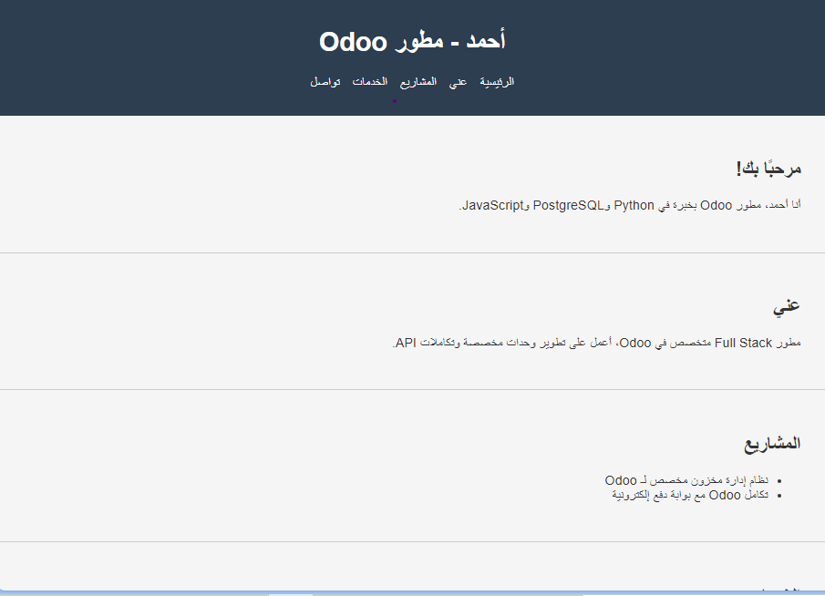

# Portfolio-Odoo
<<<<<<< HEAD
=======
# Portfolio-Odoo
>>>>>>> bdd98de40e44f3fe4e3c4b8253f209376d803645

موقع بورتفوليو شخصي لمطور Odoo، تم تصميمه باستخدام HTML وCSS فقط، بهدف عرض المهارات والخدمات والمشاريع السابقة بشكل منظم ومتجاوب.

## ✨ الميزات
- تصميم بسيط وأنيق متوافق مع جميع الأجهزة
- أقسام واضحة: عني، المشاريع، الخدمات، التواصل
- تنظيم الكود والملفات لتسهيل التعديل والتطوير لاحقًا
- قابل للتخصيص لأي مطور أو مبرمج يرغب بعرض أعماله

## 📁 التقنيات المستخدمة
- HTML5
- CSS3 (تصميم متجاوب)

## 📌 الهدف
هذا المشروع يمثل نموذجًا أوليًا لبورتفوليو مطور Odoo، ويمكن استخدامه كنقطة انطلاق لتطوير موقع شخصي احترافي أو تقديمه للعملاء على منصات العمل الحر.

## 📷 معاينة
 <!-- يمكنك رفع صورة باسم screenshot.png داخل المستودع -->

## 📬 تواصل
لأي استفسار أو تعديل، يمكن التواصل عبر البريد الإلكتروني: hamza@example.com
## 📷 معاينة

